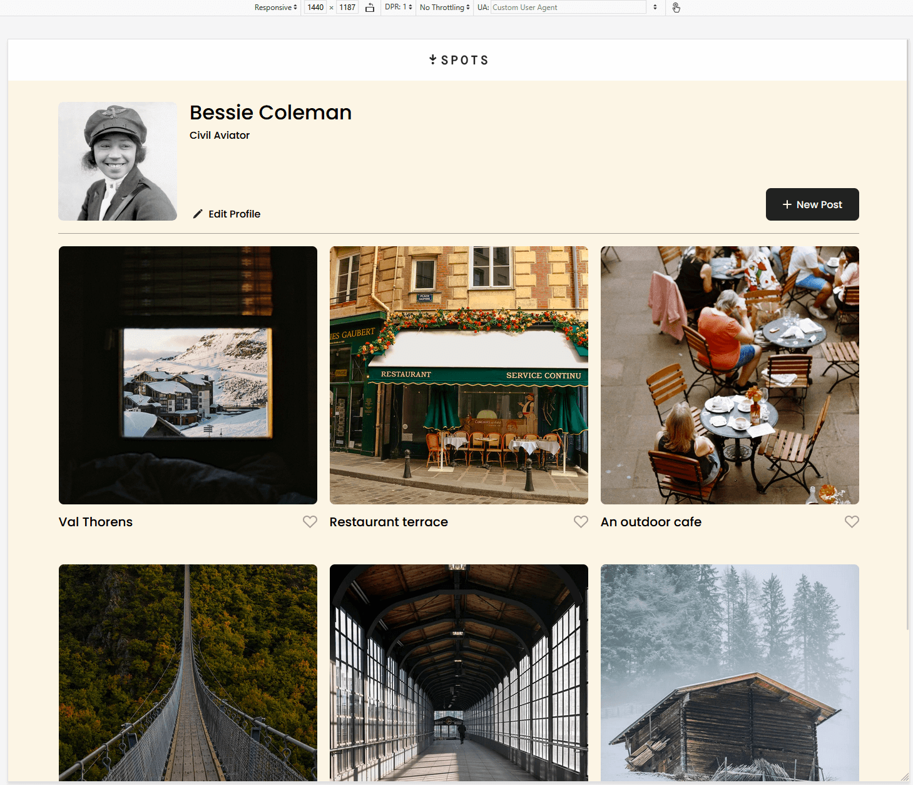
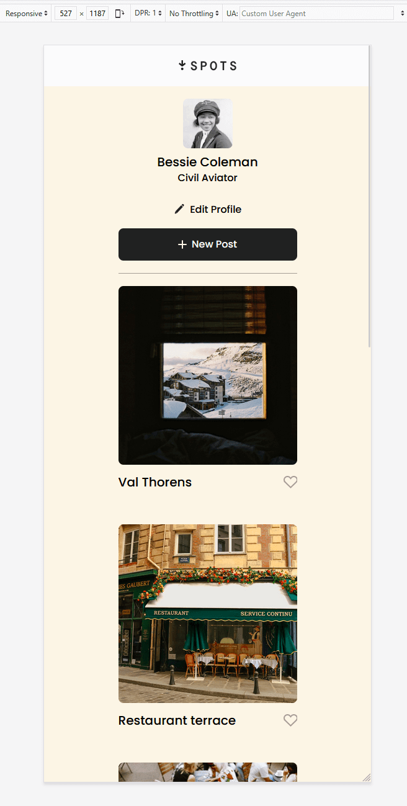

# Project 3: Spots

### Overview

- Intro
- About
- Experience
- Figma
- Images
- Loom

**Tech Stack**

- HTML
- CSS
- Responsive Design

**Deployment**
This webpage is deployed to GitHub Pages

- [Deployment Link](https://bcatriple10.github.io/se_project_spots/)

**Intro**

This project is made so all the elements are displayed correctly on popular screen sizes. We recommend investing more time in completing this project, since it's more difficult than previous ones.

**About**
This project mock up is based around social media picture sharing, similar to sites like Instagram, Pinterest, Imgur, Facebook, and X/Twitter.
The site allows streamlining your posting, removing, browsing, and liking photos, just to name a few.
This project is projected to a clean modern interface that is easy on the eyes and easy to use.

**Experience**
My experience through this project has been quite the up and down ride, trying to understand how to use Figma and copy over the correct things to make it work.
I attempted to avoid using the other elements/paddings/etc that do not fully align with how it should be in the css files. With that, figuring out how I properly place
the right paddings, margins if at all, and alignments. Despite the snags I have come across with the project, I have fully enjoyed doing it and look forward to
what other projects this program has in-store for me.

**Figma**

- [Link to the project on Figma](https://www.figma.com/file/BBNm2bC3lj8QQMHlnqRsga/Sprint-3-Project-%E2%80%94-Spots?type=design&node-id=2%3A60&mode=design&t=afgNFybdorZO6cQo-1)

**Images**

- 
- .png>)
- 
- .png>)

**Loom video**

- [Loom Link](https://drive.google.com/file/d/1xds0FnN576LdKj9XyaT9LtXkl1nqkRi3/view?usp=sharing)

I don't know if it was me, but for some reason Loom was giving me massive issues with recording quality despite the fact that I was fine before recording.
If anything came out weird I apologize, I do not know why it was doing that. I tried everything I could to edit the poor lighting even turning off my own light.
But it wouldn't work.

- side note: I do know now, post edit of my intial review from Dot I had a few issues and oversights. I will update and try to fix the video lighting issue again
  if possible, by the time I get a code developer to review any other issues winthin my code, I will then give an accurate video mirroring the corrected code.
